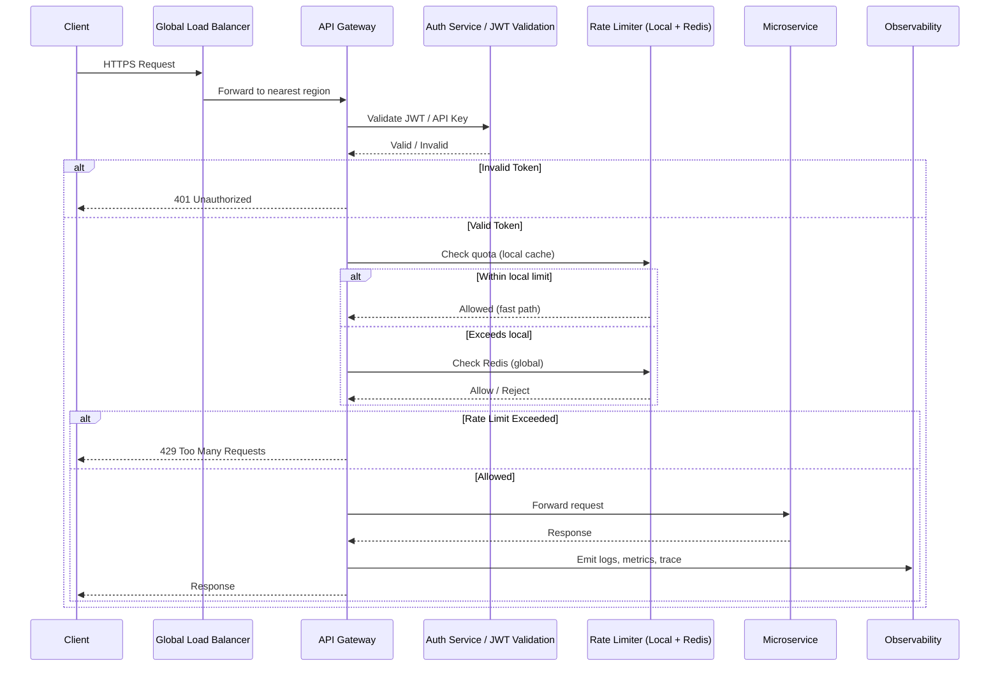
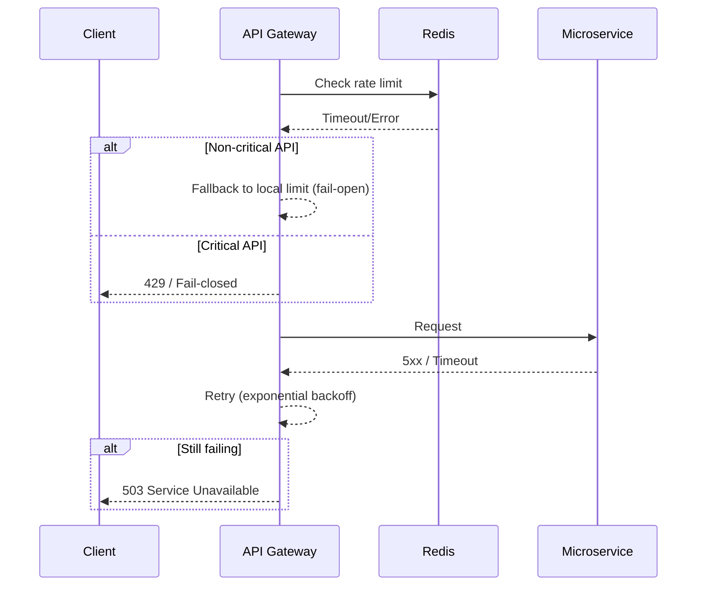

## API-Gateway Architecture:


## 🔄 Request Flow (Sequence Diagram)



### 🚨 Failure Scenarios



## 📌 Functional Requirements

### 1) Authentication & Authorization
- Supports multiple authentication mechanisms:
  - JWT
  - OAuth2
  - API keys
- Validates tokens and enforces RBAC controls.
- Integrates with identity providers:
  - Microsoft Entra ID
  - Okta

### 2) Routing
- Routes to the correct microservice based on:
  - URL path
  - Headers
  - Query parameters
- Handles versioned APIs such as `v1` / `v2`.

### 3) Rate Limiting
- Enforces limits per:
  - IP
  - User
  - Microservice
- Provides configurable quotas for baseline rate and burst handling.
- Returns correct HTTP status code (`429 Too Many Requests`) when limits are exceeded.

### 4) Load Balancing
- Distributes traffic across multiple instances of each microservice.
- Supports weighted routing and failover.

### 5) Monitoring & Logging
- Collects request/response metrics (latency, error rates).
- Collects structured logs for auditing and debugging.
- Integrates with monitoring tools such as Prometheus and Grafana.

### 6) Security
- Enforces HTTPS/TLS for all traffic.
- Provides request validation (schema, payload size).
- Protects against common attacks:
  - SQL injection
  - XSS
  - CSRF

### 7) Configuration Management
- Allows dynamic updates to routing, rate limiting, and load-balancing configurations without downtime.
- Uses centrally managed configuration with rollback capability.

---

## ⚙️ Non-Functional Requirements

### 1) Scalability
- Must handle increased traffic by scaling horizontally.
- Supports auto-scaling in cloud-native environments.

### 2) Performance
- Gateway overhead target: `< 10 ms`.
- End-to-end latency target: `< 50 ms`.
- High throughput to handle thousands of concurrent requests.

### 3) Reliability & Availability
- Ensures high availability (`99.9%` minimum baseline target).
- Provides fault tolerance and graceful degradation.

### 4) Interoperability
- Works seamlessly with heterogeneous microservices.
- Supports `gRPC`, `REST`, and `WebSocket` protocols.

### 5) Compliance
- Provides audit trails for sensitive information.
- Enforces adherence to data-privacy requirements.

### 6) Observability
- Exposes metrics and logs for monitoring and operations.

---

## 🧩 Rough Architecture

```text
                ┌────────────────────────────┐
                │        Clients / Apps       │
                │ (Web, Mobile, External APIs)│
                └──────────────┬──────────────┘
                               │
                               ▼
                ┌────────────────────────────┐
                │        API Gateway          │
                │────────────────────────────│
                │  • Authentication (JWT/OAuth2) │
                │  • Routing / Load Balancing    │
                │  • Rate Limiting / Throttling  │
                │  • Request Validation          │
                │  • Logging / Metrics           │
                └──────────────┬──────────────┘
                               │
                               ▼
        ┌────────────────────────────────────────────┐
        │           Service Mesh / Discovery          │
        │ (Consul / Istio / Kubernetes Service Mesh)  │
        └────────────────────────────────────────────┘
                               │
                               ▼
        ┌────────────────────────────────────────────┐
        │             Microservices Cluster           │
        │────────────────────────────────────────────│
        │  • User Service     • Order Service         │
        │  • Payment Service  • Inventory Service     │
        │  • Notification Service                     │
        └────────────────────────────────────────────┘
                               │
                               ▼
        ┌────────────────────────────────────────────┐
        │          Observability & Monitoring         │
        │ (Prometheus, Grafana, ELK, OpenTelemetry)   │
        └────────────────────────────────────────────┘
                               │
                               ▼
        ┌────────────────────────────────────────────┐
        │          CI/CD & Configuration Mgmt         │
        │ (GitOps, Helm, Terraform, ArgoCD)           │
        └────────────────────────────────────────────┘
```

---

## 🚦 Rate Limiting Logic

1. **Identify the client**
   - Tag each request with a unique identifier (API key, IP address, or user token).
   - Track usage per client identity.

2. **Define limits**
   - Configure allowed requests per time window (for example, `100 requests/minute`).
   - Vary limits by user tier, endpoint, or HTTP method.

3. **Track requests**
   - Maintain counters in-memory and/or in distributed stores (such as Redis).
   - Increment the relevant counter on each request.

4. **Enforce limits**
   - Reject requests once threshold is exceeded.
   - Return `HTTP 429 Too Many Requests`, optionally with `Retry-After`.

5. **Reset window**
   - Reset counters when window expires.
   - Optionally use sliding/rolling windows to smooth bursts.

---

## 📐 Scale Assumptions (Anchor in Numbers)

| Metric | Value | Notes |
|---|---:|---|
| Average QPS | 10K | Steady-state traffic |
| Peak QPS | 50K | Bursts during promotions or regional spikes |
| Payload size | 2–5 KB | Typical JSON payload |
| Tenants | 500 | Multi-tenant SaaS model |
| Regions | 3 (US-East, EU-West, APAC) | Regional isolation for latency and compliance |
| Latency budget | `< 50 ms` end-to-end | Gateway adds `< 10 ms` overhead |
| Availability target | 99.99% | HA across zones and regions |

These numbers drive design choices, including Redis sharding and stateless gateway pods.

---

## 🏗️ Architecture Refinement

### A) Physical Deployment

```text
Client
  ↓
Cloud Load Balancer (L7, e.g., AWS ALB / GCP HTTPS LB)
  ↓
API Gateway (Stateless Pods, autoscaled)
  ↓
Service Mesh (Istio / Linkerd)
  ↓
Microservices
```

- Gateway behind L7 load balancer:
  - LB handles TLS termination and global routing.
- Regional deployment:
  - Each region runs its own gateway cluster to minimize latency.
- Statelessness:
  - No session data stored locally.
  - Horizontal scaling and rolling upgrades become straightforward.
  - State (rate limits, auth cache) stored in Redis/distributed cache.

**Why stateless?**  
Scaling and resilience depend on it. Stateful gateways require sticky sessions and complicate autoscaling. Stateless pods can be replaced or scaled quickly.

### B) Control Plane vs Data Plane

| Plane | Responsibilities | Example Components |
|---|---|---|
| Data Plane | Request path: auth, routing, rate limiting, logging | Envoy, NGINX, Kong |
| Control Plane | Configuration path: policies, service discovery, feature flags | Kubernetes CRDs, etcd, config DB |

This separation keeps runtime request handling stable even during config updates.

---

## 🚦 Rate Limiting Deep Dive

### Algorithm Choice

| Algorithm | Pros | Cons | Verdict |
|---|---|---|---|
| Fixed Window | Simple | Bursty behavior | ❌ |
| Sliding Window | Smooth | More expensive | ⚠️ |
| Token Bucket | Allows bursts, predictable average | Needs distributed synchronization | ✅ Best for API Gateway |
| Leaky Bucket | Smooth shaping | Queue overhead | ❌ |

**Decision:** Token Bucket is preferred and widely used.

### Distributed Consistency
- **Problem:** Multiple gateway pods create concurrent updates.
- **Approach:**
  - Redis Cluster with sharded keys per tenant.
  - Local LRU cache in each pod for short-term counters (`1–2s TTL`).
  - Periodic asynchronous sync to Redis.

This can significantly reduce Redis pressure while retaining practical enforcement accuracy.

### Redis Bottleneck Mitigation
- Hierarchical rate limiting:
  - Local per-pod checks (fast, approximate).
  - Global Redis checks (authoritative).
- Batch updates:
  - Aggregate increments before write.
- Fallback behavior:
  - If Redis is slow/unavailable, use local limits temporarily (fail-open for non-critical tenants).

---

## 🔐 Authentication Tradeoff

| Option | Pros | Cons | Choice |
|---|---|---|---|
| Gateway validation | Centralized, offloads services | Slight latency overhead | ✅ Preferred |
| Service validation | Decentralized, potentially stricter domain-level control | Repeated validation work | ❌ |

Gateway-side validation provides consistent policy enforcement and reduces downstream complexity. Token validation results can be cached (e.g., `5 min TTL`) to reduce repeated introspection.

---

## 🧱 Failure Strategy

| Component | Failure Mode | Strategy |
|---|---|---|
| Redis | Rate limiting unavailable | Fail-open for non-critical tenants; fail-closed for premium APIs |
| Auth provider | Token introspection latency | Use cached tokens; open circuit breaker after threshold |
| Microservice | 5xx / timeout | Retry with exponential backoff; route to healthy instances |
| Gateway pod | Instance crash | Stateless auto-recovery via Kubernetes HPA |

---

## 📊 Observability

- RED metrics (Rate, Errors, Duration) per route and tenant.
- Distributed tracing with `trace_id` propagation via headers (OpenTelemetry).
- Per-tenant dashboards (latency, quota usage, error breakdown).
- Alerting for SLO violations (PagerDuty/Slack integrations).

---
