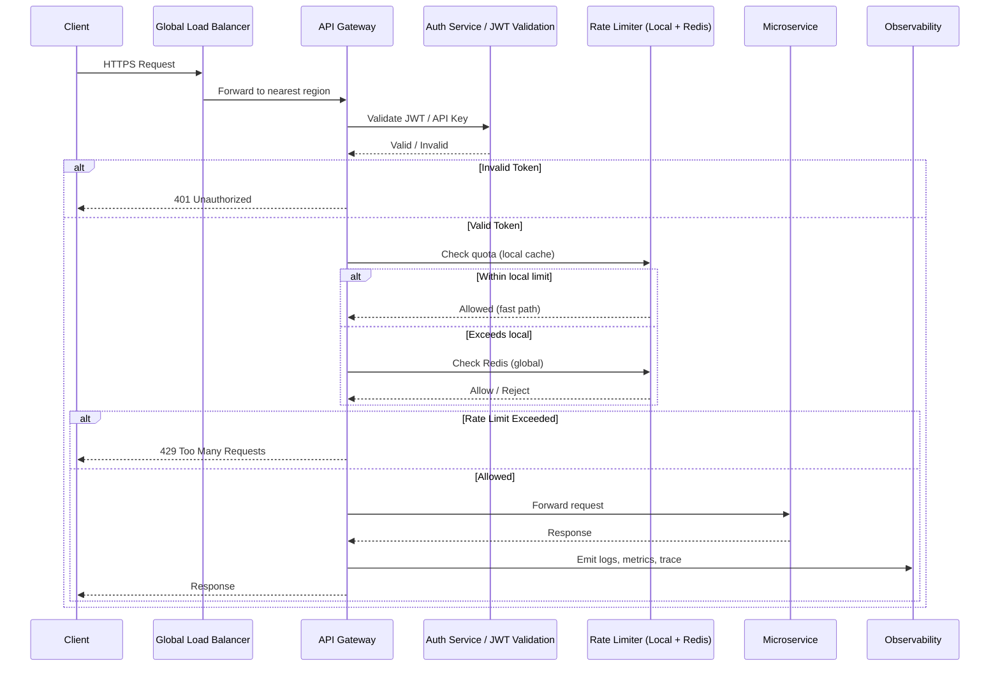
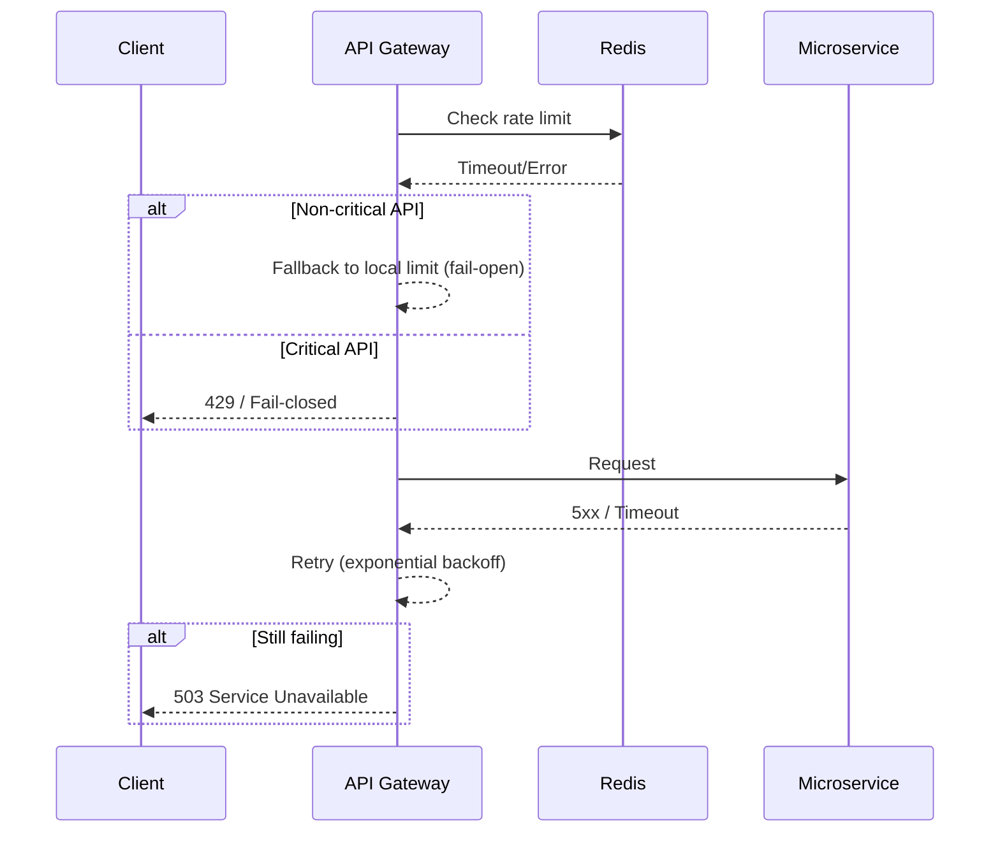

## API-Gateway Architecture:

## 🔄 Request Flow (Sequence Diagram)

```mermaid
sequenceDiagram
    participant Client
    participant LB as Global Load Balancer
    participant GW as API Gateway
    participant Auth as Auth Service / JWT Validation
    participant RL as Rate Limiter (Local + Redis)
    participant SVC as Microservice
    participant OBS as Observability

    Client->>LB: HTTPS Request
    LB->>GW: Forward to nearest region

    %% Authentication
    GW->>Auth: Validate JWT / API Key
    Auth-->>GW: Valid / Invalid

    alt Invalid Token
        GW-->>Client: 401 Unauthorized
    else Valid Token

        %% Rate Limiting
        GW->>RL: Check quota (local cache)
        
        alt Within local limit
            RL-->>GW: Allowed (fast path)
        else Exceeds local
            GW->>RL: Check Redis (global)
            RL-->>GW: Allow / Reject
        end

        alt Rate Limit Exceeded
            GW-->>Client: 429 Too Many Requests
        else Allowed

            %% Routing
            GW->>SVC: Forward request

            %% Service response
            SVC-->>GW: Response

            %% Observability
            GW->>OBS: Emit logs, metrics, trace

            GW-->>Client: Response
        end
    end

```

### 🚨 Failure Scenarios

```mermaid
sequenceDiagram
    participant Client
    participant GW as API Gateway
    participant Redis
    participant SVC as Microservice

    %% Redis Failure
    GW->>Redis: Check rate limit
    Redis-->>GW: Timeout/Error

    alt Non-critical API
        GW-->>GW: Fallback to local limit (fail-open)
    else Critical API
        GW-->>Client: 429 / Fail-closed
    end

    %% Service Failure
    GW->>SVC: Request
    SVC-->>GW: 5xx / Timeout

    GW-->>GW: Retry (exponential backoff)

    alt Still failing
        GW-->>Client: 503 Service Unavailable
    end
```
