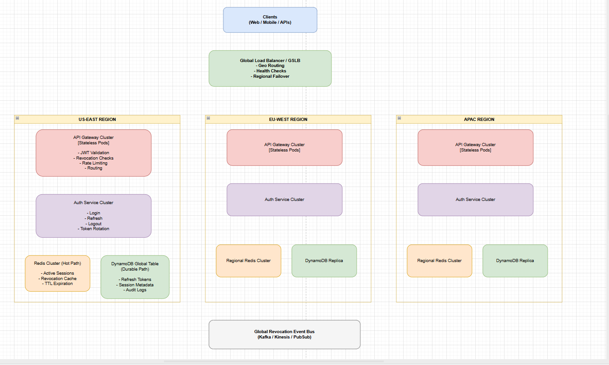
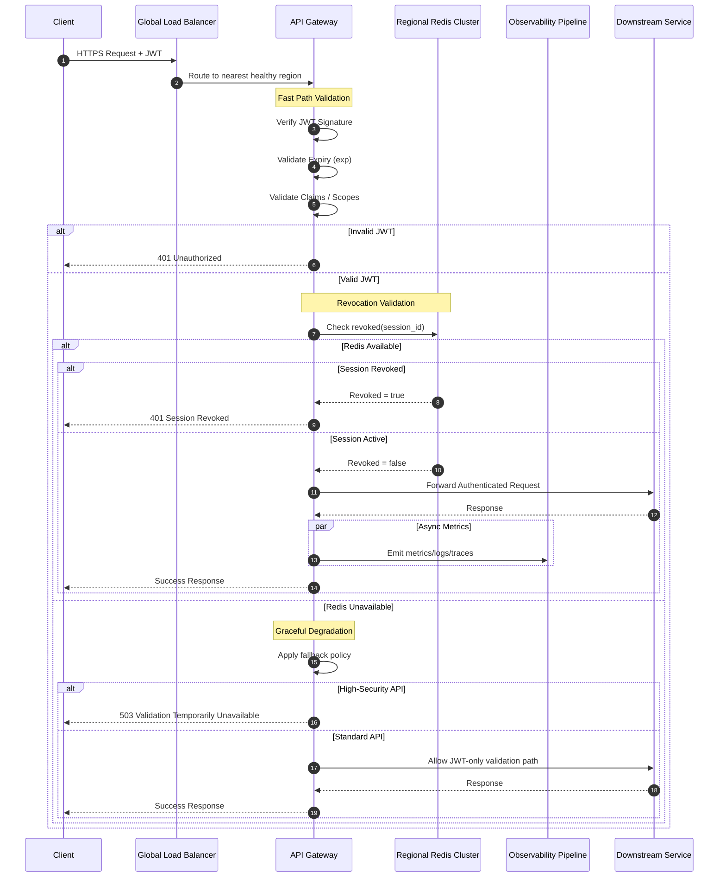
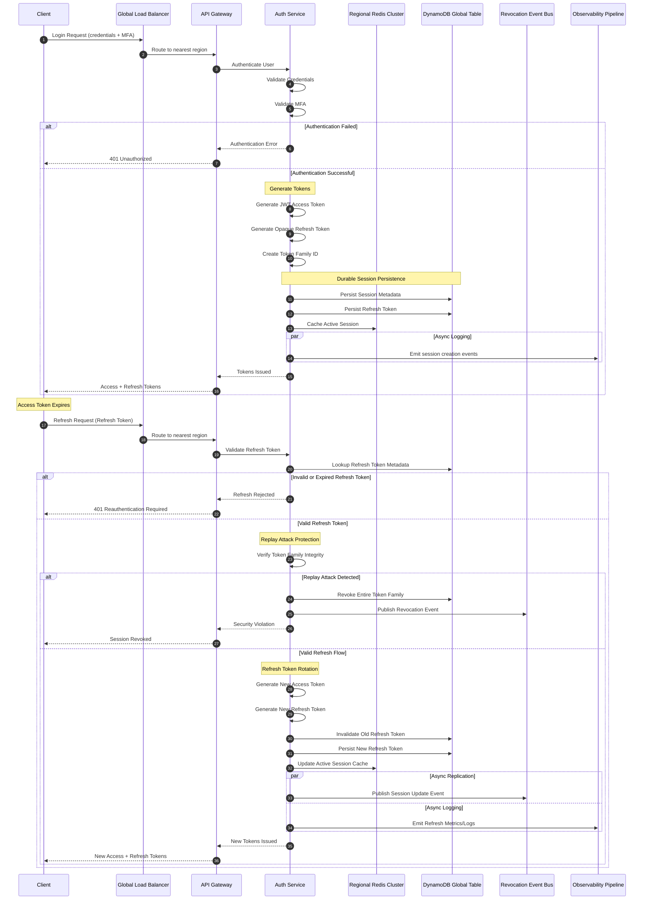
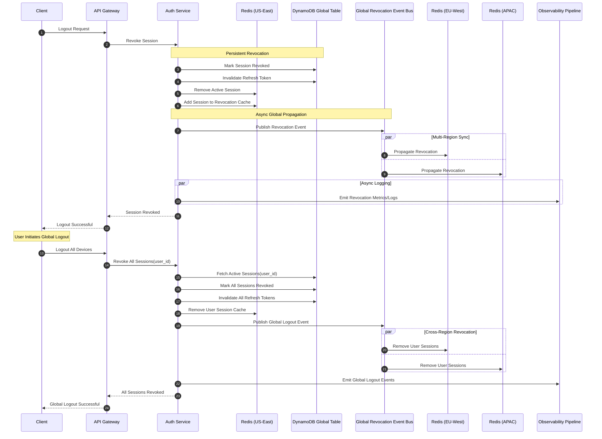
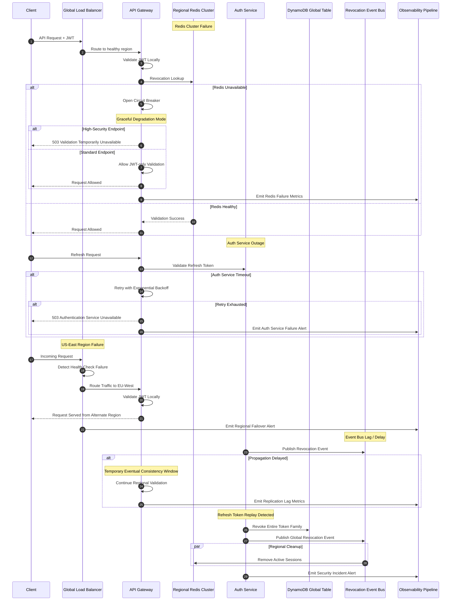

Introduction

A production-grade distributed session management system designed for:

- millions of concurrent sessions
- multi-region deployments
- secure token lifecycle management
- revocation propagation
- high availability
- low latency validation

1. Functional Requirements

Session Creation:

	Generate secure session tokens (opaque or JWT).

	Bind session to user identity and device metadata.

	Support both web and mobile clients.

Session Validation:

	Fast lookup for active sessions.

	Validate token authenticity and expiration.

	Support stateless validation (JWT) and stateful validation (session store).

Session Refresh:

	Issue refresh tokens for long-lived sessions.

	Allow silent re-authentication without forcing login.

	Rotate refresh tokens to prevent replay attacks.

Session Expiration:

	Configurable TTL (e.g., 15 min inactivity, 24 hr max).

	Sliding expiration for active usage.

	Hard cutoff for compliance/security.

Logout:

	User-initiated logout (single device).

	Global logout (all devices).

	Admin-triggered invalidation (e.g., compromised account).

Concurrent Device Handling:

	Track sessions per device.

	Allow configurable limits (e.g., max 5 active devices).

	Provide visibility to users (list active sessions, revoke individually).

Revocation:

	Immediate invalidation of compromised sessions.

	Maintain revocation list for JWTs until expiry.

	Support admin bulk revocation (e.g., security incident).

Global Scalability:

	Multi-region session stores.

	Consistent session state across regions.

	Geo-aware routing for low latency.

Audit & Monitoring:

	Log session creation, refresh, and termination.

	Detect anomalies (suspicious login patterns).

	Provide admin dashboards.

2. Non-Functional Requirements 

Latency:

	Session validation under 50 ms.

	Refresh and logout operations under 100 ms.

	Critical for real-time applications.

Consistency:

	Strong consistency for session revocation (security-critical).

	Eventual consistency acceptable for session listing across regions.

	Trade-off: JWTs allow stateless validation but require revocation strategies.

Availability:

	99.99% uptime target.

	Multi-region failover.

	Graceful degradation (e.g., fallback to cached validation).

Durability:

	Session metadata persisted in distributed store (e.g., DynamoDB, Redis Cluster).

	Ensure no silent loss of session state during failures.

Security:

	Tokens signed with strong algorithms (RSA/ECDSA).

	Refresh tokens stored securely (encrypted at rest).

	mTLS between services.

	Protection against replay, CSRF, and token theft.

	Device fingerprinting for anomaly detection.

Scalability:

	Support millions of concurrent sessions.

	Horizontal scaling of session validation services.

	Partitioning strategy (by user ID, region).

Observability:

	Metrics: active sessions, refresh rate, revocation events.

	Distributed tracing for session lifecycle.

	Alerts for anomalies (e.g., mass logouts, token replay).
	

3. Capacity Estimation

Assumptions:

	Daily Active Users (DAU): ~50M (large-scale consumer platform).

	Concurrent Sessions: ~10% of DAU active at peak → ~5M concurrent sessions.

Session Size (metadata):

	Token (JWT or opaque ID): ~512 bytes

	Device info, timestamps, flags: ~256 bytes

	Total per session ≈ 1 KB

TTL (Time-to-Live):

	Access token: 15 minutes

	Refresh token: 7 days

	Session metadata retained until expiration.

Traffic Pattern:

Writes/sec (session creation + refresh + logout):

	Assume 2% of DAU log in per minute at peak.

	50M × 0.02 ÷ 60 ≈ 16.6K writes/sec.

Reads/sec (validation checks):

	Each active session averages 1 request every 10 seconds.

	5M ÷ 10 ≈ 500K reads/sec globally.

Revocations/sec:

	Rare, but spikes during incidents.

	Normal baseline: <100/sec.

Storage Needed:

Active sessions:

	5M × 1 KB ≈ 5 GB (in-memory store like Redis).

Historical logs (audit, monitoring):

	50M sessions/day × 1 KB ≈ 50 GB/day.

	Retention: 30 days → 1.5 TB cold storage (S3, BigQuery).

Revocation list (JWT blacklist):

	Assume 0.1% of sessions revoked/day → 50K entries.

	50K × 512 bytes ≈ 25 MB (small, manageable).

Global Distribution:

Regional breakdown:

	5–6 regions (US, EU, APAC, etc.).

	Each region handles ~1M concurrent sessions.

	Reads: ~100K/sec per region.

	Writes: ~3K/sec per region.

Traffic pattern:

	95% reads (validation).

	5% writes (create/refresh/logout).

	Highly read-heavy workload → caching critical.
	
Key Takeaways:

	Hot path: ~500K reads/sec → must be served from memory (Redis, DynamoDB DAX, or stateless JWT validation).

	Cold path: ~16K writes/sec → distributed session store with strong consistency for revocation.

	Storage footprint: modest (GBs in memory, TBs in logs).

	Scaling strategy: partition by user ID + region, replicate revocation lists globally.

4. API Design

Create Session:

	Used during login or token refresh.

	Endpoint:  
	POST /api/v1/sessions

	Request:

	json
	{
	  "user_id": "12345",
	  "device_id": "device-abc",
	  "auth_token": "oauth_or_password_token",
	  "client_ip": "192.168.1.10",
	  "user_agent": "Mozilla/5.0"
	}
	Response:

	json
	{
	  "session_id": "sess-xyz",
	  "access_token": "jwt_or_opaque_token",
	  "refresh_token": "refresh-123",
	  "expires_in": 900,   // seconds (15 min)
	  "issued_at": "2026-05-21T08:08:00Z"
	}
	
Validate Session: 
	Used on every request to check if the session is active and valid.

	Endpoint:  
	POST /api/v1/sessions/validate

	Request:

	json
	{
	  "access_token": "jwt_or_opaque_token"
	}
	Response:

	json
	{
	  "valid": true,
	  "user_id": "12345",
	  "session_id": "sess-xyz",
	  "device_id": "device-abc",
	  "expires_at": "2026-05-21T08:23:00Z"
	}
	
Revoke Session:
	Used for logout (single device) or global logout (all devices).

	Endpoint:  
	POST /api/v1/sessions/revoke

	Request:

	json
	{
	  "session_id": "sess-xyz",
	  "scope": "single"   // options: "single", "all"
	}
	Response:

	json
	{
	  "revoked": true,
	  "session_id": "sess-xyz",
	  "scope": "single",
	  "timestamp": "2026-05-21T08:09:00Z"
	}
	
Refresh Session: 
	Used to obtain a new access token using a refresh token.

	Endpoint:  
	POST /api/v1/sessions/refresh

	Request:

	json
	{
	  "refresh_token": "refresh-123",
	  "device_id": "device-abc"
	}
	Response:

	json
	{
	  "session_id": "sess-xyz",
	  "access_token": "new-jwt-or-opaque",
	  "refresh_token": "refresh-456",
	  "expires_in": 900,
	  "issued_at": "2026-05-21T08:10:00Z"
	}
	
List Active Sessions:
	Allows users/admins to view all active sessions across devices.

	Endpoint:  
	GET /api/v1/sessions

	Response:

	json
	{
	  "sessions": [
		{
		  "session_id": "sess-xyz",
		  "device_id": "device-abc",
		  "ip": "192.168.1.10",
		  "created_at": "2026-05-21T07:55:00Z",
		  "expires_at": "2026-05-21T08:23:00Z"
		},
		{
		  "session_id": "sess-def",
		  "device_id": "device-mobile",
		  "ip": "203.0.113.5",
		  "created_at": "2026-05-20T22:15:00Z",
		  "expires_at": "2026-05-21T08:30:00Z"
		}
	  ]
	}

Design Notes: 

Tokens: Access tokens are short-lived (JWT or opaque). Refresh tokens are long-lived and rotated.

Revocation: Immediate invalidation requires a revocation list or centralized session store.

Multi-device: Each device gets its own session entry; global logout wipes all.

Admin control: Admin can revoke sessions by user_id for compromised accounts

5. Data Model

Session Record — Core Fields

	session_id  
	Unique identifier for the session (UUID or ULID).

	user_id  
	Reference to the authenticated user.

	device_id  
	Identifier for the client device (mobile, browser fingerprint, etc.).

	access_token  
	Short-lived token (JWT or opaque string).

	refresh_token  
	Long-lived token, rotated on refresh.

	issued_at  
	Timestamp when the session was created.

	expires_at  
	Expiration timestamp for the access token.

	last_activity_at  
	Sliding expiration marker (updated on activity).

	ip_address  
	Last known client IP.

	user_agent  
	Browser/OS metadata for device fingerprinting.

	status  
	Enum: active, revoked, expired.

	revoked_at  
	Timestamp if the session was invalidated.

	revoked_by  
	Actor who revoked (user, admin, system).

	geo_location (optional)  
	Derived from IP for anomaly detection.

	concurrent_device_flag  
	Boolean or counter for multi-device handling.

Extended Metadata (Optional but Useful)

	mfa_verified  
	Boolean indicating if MFA was used.

	session_type  
	Enum: web, mobile, api.

	scopes/roles  
	Permissions tied to the session.

	anomaly_flags  
	Indicators for suspicious activity (e.g., impossible travel).

	audit_log_id  
	Link to external audit trail.

Storage Considerations
	Hot store (Redis/DynamoDB):  
		Holds active session records for fast validation.
		Indexed by session_id and user_id.

	Cold store (S3/BigQuery):  
		Retains expired/revoked sessions for compliance and analytics.
		Indexed by user_id and revoked_at.

Example JSON Record:
	json
	{
	  "session_id": "sess-xyz",
	  "user_id": "12345",
	  "device_id": "device-abc",
	  "access_token": "jwt-or-opaque",
	  "refresh_token": "refresh-123",
	  "issued_at": "2026-05-21T08:08:00Z",
	  "expires_at": "2026-05-21T08:23:00Z",
	  "last_activity_at": "2026-05-21T08:15:00Z",
	  "ip_address": "192.168.1.10",
	  "user_agent": "Mozilla/5.0",
	  "status": "active",
	  "revoked_at": null,
	  "revoked_by": null,
	  "geo_location": "Bengaluru, IN",
	  "mfa_verified": true,
	  "session_type": "web",
	  "scopes": ["read", "write"],
	  "anomaly_flags": []
	}

6. Database Choice

1. Redis (In-Memory, Distributed Cache/Store)
	Pros:

		Extremely low latency (<1 ms reads).

		Native TTL support for session expiration.

		High throughput (hundreds of thousands of ops/sec).

		Good fit for hot path validation (access tokens).

	Cons:

		Limited durability (in-memory, persistence optional).

		Requires careful sharding/replication for global scale.

		Revocation lists can grow large if not pruned.

	Best Use: Active session store (fast validation, revocation checks).

2. DynamoDB (AWS NoSQL, Global Tables)
	Pros:

		Strong durability and availability (multi-region replication).

		Scales automatically to millions of sessions.

		Fine-grained access control and audit integration.

		TTL attribute support for automatic expiration.

	Cons:

		Higher latency than Redis (~10–20 ms).

		Costs can spike with high read/write throughput.

		Eventual consistency in global tables unless forced strongly consistent reads.

	Best Use: Persistent session metadata (audit logs, refresh tokens, compliance).

3. Cassandra (Distributed NoSQL)
	Pros:

		Linear scalability across clusters.

		Tunable consistency (choose between strong/eventual).

		Good for write-heavy workloads.

	Cons:

		Operational complexity (cluster management).

		Higher latency than Redis.

		Not as seamless for global replication compared to DynamoDB.

	Best Use: Large-scale session history storage, if self-managed infra is preferred.

4. SQL (Postgres/MySQL)
	Pros:

		Strong consistency and relational integrity.

		Easy to query for analytics and reporting.

		Mature ecosystem and tooling.

	Cons:

		Hard to scale to millions of concurrent sessions.

		Write-heavy workloads can bottleneck.

		Requires sharding/partitioning for global scale.

	Best Use: Admin dashboards, compliance queries, and secondary analytics.

Recommended Hybrid Approach
	Redis Cluster (Hot Path):  
	Store active sessions and revocation lists. Optimized for speed and TTL-based expiration.

	DynamoDB Global Tables (Durable Path):  
	Persist refresh tokens, audit logs, and session metadata. Ensures durability and compliance across regions.

	SQL (Optional, Secondary):  
	For admin reporting, anomaly detection, and compliance queries where relational joins matter.

Tradeoff Summary

| Store | Latency | Durability | Scalability | Best Role |
| --- | ---: | --- | --- | --- |
| Redis | <1 ms | Low–Medium | High | Active session validation |
| DynamoDB | 10–20 ms | High | Very High | Persistent metadata, refresh tokens |
| Cassandra | 5–15 ms | High | High | Large-scale history (self-managed) |
| SQL | 10–50 ms | High | Medium | Analytics, admin dashboards |

The sweet spot for a global, secure, high-scale system is Redis + DynamoDB hybrid: Redis for blazing-fast validation, DynamoDB for durability and compliance.

7. High-Level Architecture

 Auth Service (Control Plane)
	Create Session API → Validates credentials/MFA, issues access + refresh tokens.

	Refresh Session API → Validates refresh token, rotates, issues new access token.

	Revoke Session API (global/single) → Marks session(s) revoked in durable store + publishes revocation event.

	List Sessions API → Queries durable store for active sessions per user.

Key Role: Token issuance, refresh, and lifecycle management.

 Session Store (Data Plane)
	Redis Cluster (Hot Path):

		Stores active session records (session_id → metadata).

		Used by Validate Session API for fast lookups.

		TTL ensures automatic expiration.

		Revocation list maintained here for immediate invalidation.

	DynamoDB Global Tables (Durable Path):

		Stores refresh tokens, device metadata, audit logs.

		Queried by List Sessions API and Revoke Session API.

		Streams propagate revocation events across regions.

 API Gateway / Validation Layer
	Validate Session API:

		Stateless JWT validation (signature + expiry).

		If opaque token → Redis lookup.

		Checks revocation list before allowing downstream traffic.

		Circuit breakers protect downstream services if session store is slow.

 Replication & Multi-Region
	Global Load Balancer (L7):

		Routes requests to nearest region.

	Regional Clusters:

		Redis + DynamoDB replicas per region.

		Validation is local for low latency.

	Revocation Sync:

		DynamoDB streams or pub/sub propagate revocation events globally.

		Ensures compromised sessions are invalidated everywhere.

 Observability & Security
	Audit Logs: Every API call (create, refresh, revoke, validate) logged in DynamoDB/S3.

	Metrics: Active sessions, validation latency, revocation events.

	Tracing: Session lifecycle traced across services.

	Security: mTLS between services, encryption at rest, anomaly detection (IP/device mismatch).

Flow Mapping:
	Create Session → Auth Service → Redis + DynamoDB write.

	Validate Session → API Gateway → Redis lookup or JWT signature check.

	Refresh Session → Auth Service → DynamoDB check + Redis update.

	Revoke Session → Auth Service → Redis delete + DynamoDB update + global sync.

	List Sessions → Auth Service → DynamoDB query (per user).
	

8. Failure Scenarios

 Redis Down (Hot Path Failure)
	Impact:

	Session validation fails for opaque tokens.

	Revocation checks unavailable → risk of accepting compromised tokens.

	Mitigation:

	Fallback to stateless JWT validation (signature + expiry).

	Graceful degradation: allow requests with valid JWTs, skip revocation temporarily.

	Redis cluster with replicas + auto-failover.

	Circuit breaker at gateway to avoid cascading retries.

 Database Lag (DynamoDB / Cassandra)
	Impact:

	Refresh token validation delayed.

	Session listing/revocation queries slow.

	Mitigation:

	Use Redis as cache for recent refresh tokens.

	Async writes with eventual consistency for non-critical metadata.

	Retry with exponential backoff.

	Alerting + autoscaling to handle throughput spikes.

 Region Outage
	Impact:

	Users in affected region cannot validate sessions locally.

	Risk of increased latency if routed cross-region.

	Mitigation:

	Global load balancer reroutes traffic to nearest healthy region.

	Redis + DynamoDB replicated across regions.

	Accept slight latency increase but maintain availability.

	Quota partitioning per region to prevent abuse during failover.

 Token Replay Attack
	Impact:

	Stolen token reused by attacker.

	Unauthorized access until token expires.

	Mitigation:

	Short-lived access tokens (e.g., 15 min).

	Refresh token rotation (invalidate old refresh token once used).

	Device binding (token tied to device_id + IP).

	Anomaly detection (impossible travel, IP mismatch).

 Stale Session (Expired but Still Accepted)
	Impact:

	User continues using expired token if validation is inconsistent.

	Mitigation:

	Strict TTL enforcement in Redis/DynamoDB.

	JWT expiry check at gateway.

	Revocation list cleanup ensures expired tokens are not mistakenly valid.

	Sliding expiration only if explicitly configured.

 Revocation Sync Delay
	Impact:

	Session revoked in one region but still valid in another.

	Mitigation:

	DynamoDB streams or pub/sub propagate revocation events globally.

	Critical APIs enforce strong consistency (check central store).

	For non-critical APIs, accept eventual consistency.

 Auth Service Slow/Unavailable
	Impact:

	New session creation and refresh blocked.

	Existing sessions still valid until expiry.

	Mitigation:

	Decouple validation (gateway can validate JWTs without auth service).

	Queue refresh requests until service recovers.

	Multi-region active-active auth service deployment.

Key Design Principle:

	Hot path (validation): Must always degrade gracefully → JWT signature validation fallback.

	Cold path (create/refresh/revoke/list): Can tolerate retries and slight delays.

	Global resilience: Multi-region replication + failover ensures availability even during outages.

## Session-Management Architecture:

## Session Validation Sequence Flow

### Key Architectural Insight

The validation path intentionally avoids synchronous calls to the Auth Service or durable databases.

This allows the system to scale to hundreds of thousands of validation requests per second while maintaining low latency.

The primary tradeoff is balancing:
- stateless scalability (JWT validation)
vs
- centralized control (revocation and session management)

Regional Redis clusters provide near real-time revocation checks without introducing global validation latency.

## Session Creation & Refresh Sequence Flow

### Refresh Token Security Model

Refresh tokens are treated as high-value credentials and are always statefully managed.

The system uses:
- refresh token rotation
- token family tracking
- replay detection

to mitigate token theft and replay attacks.

If a previously used refresh token is reused, the entire token family is revoked to contain compromise.

This design intentionally trades additional state management complexity for significantly stronger security guarantees.

## Session Revocation & Global Logout Sequence Flow

### Consistency Tradeoff

The system intentionally prioritizes:
- low-latency regional validation
over
- globally synchronous revocation enforcement.

Revocation events propagate asynchronously across regions using an event bus.

This introduces a small eventual consistency window where a recently revoked session may still validate in another region until propagation completes.

For high-security operations, services may optionally perform strongly consistent checks against the durable session store.

### Why Not Global Synchronous Revocation?

Globally synchronous revocation would require:
- cross-region coordination
- higher validation latency
- reduced availability during regional failures

The system instead uses:
- regional low-latency validation
- asynchronous revocation propagation
- selective strong consistency for critical operations

to balance scalability, security, and availability.

## Failure Handling & Graceful Degradation Flow

### Reliability Philosophy

The system separates:
- the hot validation path
from
- the control plane lifecycle operations.

This allows existing sessions to continue functioning even during:
- Auth Service outages
- regional failures
- revocation propagation delays

Validation degrades gracefully using:
- local JWT verification
- regional caches
- selective fail-open policies

while critical security operations continue using strongly consistent durable storage.

